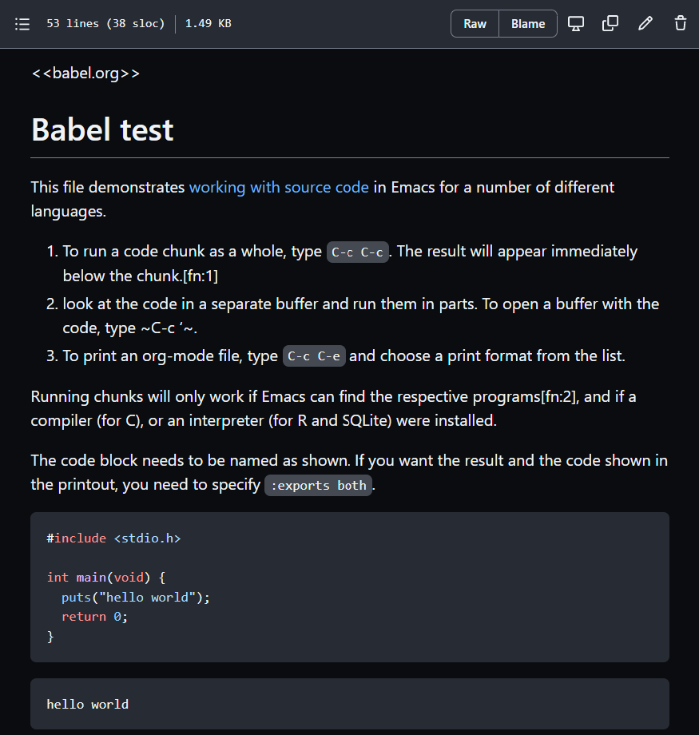

# Table of Contents

1.  [What are you going to learn?](#org2bd041f)
2.  [Why we don't just get coding](#orgdaa0748)
3.  [Emacs for C programming](#org2ce07f3)
    1.  [What is Emacs ?](#org568c2a7)
    2.  [How do you use Emacs?](#org103a0fd)
    3.  [How will we use Emacs?](#org8da63cd)
    4.  [Does it really have to be Emacs?](#orge2f7fe8)
    5.  [What about Emacs' famously "steep learning curve" ?](#org84095c9)
4.  [Infrastructure Setup](#org961b354)
5.  [Install a C compiler (Windows + MacOS)](#org875e59e)
    1.  [Windows](#org8c712a7)
    2.  [MacOS](#org8b5613d)
6.  [Install Emacs](#org2f8816a)
    1.  [Download and Installation for Windows](#org9831c76)
    2.  [Download and Installation for MacOS](#org2e74b26)
7.  [Customize Emacs](#org6f57d3a)
    1.  [Create configuration file](#org7cd364c)
    2.  [Create sample notebook](#org46f7c14)
    3.  [Layout changes](#org9d21aab)
        1.  [Customize theme and font](#org6aa1f01)
    4.  [Installing additional packages](#org1e6a60f)
    5.  [Presenting in Emacs](#orgd9591ac)
    6.  [Definitions and functions](#org19c231d)
    7.  [Adding images and links to Org-mode files](#org3b4311b)
    8.  [Tables](#org5ff6c13)
    9.  [Export](#orga1e30e8)
8.  [GitHub](#orgde522dd)
    1.  [What is it?](#org878bd1c)
    2.  [Why are we using it?](#org5be3ade)
    3.  [What will you have to do?](#org1a4b8f0)
    4.  [What else can you do?](#orgfbe0269)
9.  [Summary](#orgb39c7d1)
10. [Jargon](#org430ee43)
11. [What's next](#orgb882d9c)
12. [References](#org6d94b86)

# What are you going to learn?

-   Why we don't just get coding
-   Setting up infrastructure
-   Install a C compiler
-   Install the Emacs editor and IDE
-   Customize the IDE
-   Understand and learn to use GitHub
-   Summary of concepts/code
-   What's next

# Why we don't just get coding

There are two reasons - one is philosophical, the other is
technical.

> "Understanding underlying technologies helps you develop a sense of
> what can go wrong. Knowing just high-level tools makes it easy to ask
> the wrong questions. It's worth learning to use a hammer before
> graduating to a nail gun. Learning underlying systems and tools gives
> you the power to build new tools, which is important because there
> will always be a need for tool builders, even if tool users are more
> common. Learning about computers so that the behavior of programs
> isn't a mystery enables you to craft better code." (Steinhart, 2019)

The other reason has to do with C itself:

<table border="2" cellspacing="0" cellpadding="6" rules="groups" frame="hsides">

<colgroup>
<col  class="org-left" />

<col  class="org-left" />
</colgroup>
<thead>
<tr>
<th scope="col" class="org-left">TASK</th>
<th scope="col" class="org-left">SOFTWARE</th>
</tr>
</thead>

<tbody>
<tr>
<td class="org-left">C source code needs to be written and edited</td>
<td class="org-left">editor</td>
</tr>

<tr>
<td class="org-left">C source code needs to be compiled, linked and debugged</td>
<td class="org-left">compiler</td>
</tr>

<tr>
<td class="org-left">C object code needs to be run</td>
<td class="org-left">shell</td>
</tr>
</tbody>
</table>

*Image: C programming workflow / BPMN model*

There are different routes to getting C running on your computer,
depending on your operating system (Linux, MacOS or Windows)<a id="fnr.1" class="footref" href="#fn.1">1</a>.

The problem with most IDEs is that they're clunky. They take some
time getting used to, have many functions that you'll never need,
and any time spent on learning the IDE is wasted unless you keep
working with it. IDEs do not teach you transferable skills.

# Emacs for C programming

## What is Emacs ?

/Image: Emacs 27.1 showing Org, Magit and Dired
buffers with the modus-operandi theme, without window titlebar or
borders. Source: [Wikipedia](https://en.wikipedia.org/wiki/Emacs#/media/File:Emacs27_showing_Org,_Magit,_and_Dired_with_the_modus-operandi_theme.png)/

Emacs is an extensible editor written in C, with Emacs Lisp, a Lisp
dialect, as an extenstion language. It was first released
in 1985. Its extensibility and a large, active, passionate
community of developers and users made sure that it still evolves
in 2021<a id="fnr.2" class="footref" href="#fn.2">2</a>.

## How do you use Emacs?

I've written an article about this for the introductory data
science course ([FAQ](https://github.com/birkenkrahe/org/blob/master/FAQ.md#which-editor-and-ide-do-you-use)). I use Emacs for most of my computing needs,
not just as an editor, but also for writing, organizing, and
planning. See also "[Getting started with Emacs"](https://opensource.com/article/20/3/getting-started-emacs) (Kenlon, 2020).

## How will we use Emacs?

We'll use it as:

-   EDITOR to write source code,
-   NOTEBOOK to write literate programs, and
-   SHELL to build and run code.

## Does it really have to be Emacs?

You'll handle it. Keep calm and carry on coding.

If you look around, you'll see a lot of discussion on different
source code editors and IDEs. Currently Microsoft's VS Code seems
to be the most popular contender. However, as one developer said:

> "One thing that cannot be replaced by any extension in VS code, VIM or
> any other editor: Emacs' Org mode Org mode is for sure one of the most
> amazing pieces of software I have ever seen or worked with. It does
> things that no other text-based word processor can do, even if you are
> writing complex scientific reports. VS code has an extension which
> brings less than 5% of Org mode functionality, tops and that is mostly
> the code highlighting." ([Timachi, 2019](https://hadi.timachi.com/2019/12/07/Why_I_switched_from_VScode_to_Emacs))

## What about Emacs' famously "steep learning curve" ?

> "Emacs can be a challenge if you are used to using mouse
> pointer. One should be willing to leave the mouse and stick with
> the keyboard." ([Timachi, 2019](https://hadi.timachi.com/2019/12/07/Why_I_switched_from_VScode_to_Emacs))

Also, computer science, and IT, are largely about mastering, and
creating new digital tools. Therefore, almost any effort is
justified that goes into improving your meta skills<a id="fnr.3" class="footref" href="#fn.3">3</a> in this area.

# Infrastructure Setup

The sections below cover most of the infrastructure used in my
courses. They are also available as [FAQs on GitHub](https://github.com/birkenkrahe/org/blob/master/FAQ.md#orga3d6f39).

If you look at this at GitHub, look at `.org` files for syntax
highlighting.

# Install a C compiler (Windows + MacOS)

## Windows

-   Download the installer [from sourceforge](https://sourceforge.net/projects/mingw-w64/).
-   Run the installer - accept all presets.
-   Add the location of the executable file `gcc` to the Windows
    `PATH` (you can find it in `C:\Program Files(x86)\mingw-w64\`)
    
    -   Search for `PATH` and open the menu `System Properties`
        
        
    
    -   Open the menu `Environment Variables`, click on the `PATH`
        variable and choose `Edit`
        
        
    
    -   Click on `New` and paste the path into the empty line. Confirm
        three times with `OK` to close all
    
    menus.
    
    
    
    -   To test, search for `CMD`, open a terminal and enter `gcc
               --version` - you should get the output shown below. Close the
        window.
        
        

## MacOS

Apple no longer allows GNU tools - instead, you can install the
Clang compiler.

-   Check if you already have a C compiler: open a terminal (search
    for `terminal` app) and enter `cc -v`.
-   If no compiler is found, download it by entering `xcode-select
         --install`
-   Test it by typing `cc -v`.
    
    

# Install Emacs

*Image: GNU Emacs logo. Source: [GNU Project](https://www.gnu.org/software/emacs/)*

## Download and Installation for Windows

-   Download GNU Emacs + ESS as a modified version for [Windows](https://vigou3.gitlab.io/emacs-modified-windows/).
-   Run the installer - accept all presets.
-   Check out the [guided tour](https://www.gnu.org/software/emacs/tour/).
-   Open Emacs, type `CTRL-h t` (`C-h t`) and complete the tutorial.

## Download and Installation for MacOS

-   Download GNU Emacs + ESS as a modified version for [MacOS](https://vigou3.gitlab.io/emacs-modified-macos/).
-   Run the installer - accept all presets.
-   Check out the [guided tour](https://www.gnu.org/software/emacs/tour/).
-   Open Emacs, type `CTRL-h t` (`C-h t`) and complete the tutorial.

# Customize Emacs

GNU Emacs is much more than a text editor and an IDE. It's more like
an operating system inside your operating system. Among the many
things that Emacs is capable of, we only need one for this class:
the ability to create and run interactive notebooks.

This will give you the power of Jupyter notebooks or Colaboratory on
your computer, and you can share notebooks with anyone, who has
Emacs.

The central package for many day to day tasks is `Org-mode`. Here is
a set of [Org-mode tutorials](https://orgmode.org/worg/org-tutorials/) (with videos) covering many interesting
applications. Org-mode is especially popular among scientists, and
among these, physicists (my original tribe), who developed it.

And here is an excellent video tutorial by someone who is also
getting started with Emacs for the first time like you:

-   [The Absolute Beginner's Guide to Emacs](https://youtu.be/48JlgiBpw_I) (System Crafters, 2021) -
    1hr30min.

## Create configuration file

To create interactive computing notebooks in Emacs, we use the
[Org-mode](https://orgmode.org/) and [Babel](https://orgmode.org/worg/org-contrib/babel/intro.html) packages. Both are already installed in your
version of Emacs, but you have to tell Babel, which languages you
want to work with.

Customization like this is done with a configuration file `.emacs`,
which is placed in your home directory (`~/~`). Where this folder
is actually located on your computer depends on your operating
system.

Download the configuration file [from GitHub](https://github.com/birkenkrahe/cc100/blob/main/2_installation/.emacs). Here is the code, in
case you want to copy and paste it from here.

    
    (put 'dired-find-alternate-file 'disabled nil)
    
    ;; require ob-sqlite and ob-sql (for compilation in org src blocks) & tangle
    (require 'ob-sqlite)
    (require 'ob-sql)
    (require 'ob-emacs-lisp)
    
    ;; active Babel languages
    (org-babel-do-load-languages
     'org-babel-load-languages
     '((R . t)
       (sql . t)
       (python . t)
       (emacs-lisp . t)
       (C . t)))
    
    ;; Syntax highlight code in your SRC blocks The last variable removes
    ;; the annoying “Do you want to execute” your code when you type:
    ;; C-c C-c
    (setq org-confirm-babel-evaluate nil
          org-src-fontify-natively t
          org-src-tab-acts-natively t)
    
    ;; enable snippet expansion via org-structure-template-alist
    (require 'org-tempo)
    
    ;; get packages from MELPA package manager
    (require 'package)
    (add-to-list 'package-archives
    	     '("melpa-stable" . "https://stable.melpa.org/packages/"))

    ((gnu . https://elpa.gnu.org/packages/) (melpa-stable . https://stable.melpa.org/packages/) (melpa . https://melpa.org/packages) (gnu . https://elpa.gnu.org/packages) (org . https://orgmode.org/elpa/))

## Create sample notebook

To create a notebook, create an `.org` file. Then type `C-c C-,`
and select your chunk from the list. You can also abbreviate this
by entering `<s` on any line.

Check out <./babel_c.md> for examples with C code blocks<a id="fnr.4" class="footref" href="#fn.4">4</a>.

## Layout changes

You can completely change anything about the way Emacs looks, feels
and behaves. Here are a few suggestions with code snippets based on
my own customizations.

If you change your `~/.emacs` file, you need to evaluate the file
(`M-x h evaluate-region`) or restart Emacs to see the changes.

Emacs Lisp is a fun language to learn, because through Emacs you
can play around with it and see what it does much more easily than
with other languages. Here is a [complete tutorial for
non-programmers](https://www.gnu.org/software/emacs/manual/html_node/eintr/). Lisp (and Emacs Lisp) is a functional programming
language (like R).

### Customize theme and font

To change the theme, enter `M-x custom-themes`. Activate `Save
    theme settings` if you want the settings to become permanent. This
will modify your `.emacs` configuration file.

You can also upload fonts and change fonts. You can do this
easiest by opening the `Options` menu at the top of the Emacs
screen and selecting `Set default font` from the list.

If you don't have the menu bar, enter `M-x menu-bar-mode` - this
will toggle the menu bar, i.e. you can make it appear or disappear
with this command. If you don't have a mouse, you can open the
menus with `<F10>`. I don't tend to use it at all, since one of
the advantages of Emacs is that everything can be done with the
keyboard (which is way faster than the mouse).

If you want to get into this for whatever reason, [check this out](https://zzamboni.org/post/beautifying-org-mode-in-emacs/)
(Zamboni, 2018).

## Installing additional packages

There are hundreds of useful packages available for instant
installation. To see them, enter `M-x package-list-packages`.

The screenshot shows part of the listing, with `available`,
`installed` (by me), and `built-in` (by GNU Emacs) files.

To install a package

-   search and find it (forward search with `C-s` or backward search
    with `C-r`)
-   enter `i` to mark the package for installation
-   enter `x` to install it.

## Presenting in Emacs

I often present in Emacs, especially when I use interactive
notebooks. I use `org-slide-tree-mode` for that ([see
documentation](https://github.com/takaxp/org-tree-slide)). You need to install the package `org-tree-slide`
and put the code below into your `/.emacs` file.

    
    ;; org-tree-slide: https://github.com/takaxp/org-tree-slide
    ;; to activate: M-x org-tree-slide-mode or <f9> - stop S-<f9>
    (require 'org-tree-slide)
    (with-eval-after-load "org-tree-slide"
      (global-set-key (kbd "<f9>") 'org-tree-slide-mode)
      (global-set-key (kbd "S-<f9>") 'org-tree-slide-skip-done-toggle)
      (define-key org-tree-slide-mode-map (kbd "<f8>") 'org-tree-slide-move-previous-tree) ;; move forwards
      (define-key org-tree-slide-mode-map (kbd "S-<f8>") 'org-tree-slide-move-next-tree)  ;; move backwards
      )
    (setq org-image-actual-width nil)
    (setq org-tree-slide-skip-outline-level 0)
    (setq org-tree-slide-slide-effect t)
    (org-tree-slide-simple-profile) ;; no headers

    simple profile: ON

In the code, `<f9>` is used to switch the mode on or off (`SHIFT +
   <f9>`), and `<f8>` to move one slide forward or backward (`SHIFT +
   <f8>`). Slide headers have been removed. If you want slide
headers, comment the last line by putting `;;` in front of it like
this:

    
    ;; (org-tree-slide-simple-profile) ;; no headers

## Definitions and functions

You can use `M-Q` to fill a region (wrap the text and cut it off
after 70 characters, a value set in `fill-column`). Sometimes it
is useful to unfill a region (put it on one line, for example to
copy it into an email). If you put the following definition into
your `~/.emacs` file, you can use `M-x unfill-region` to achieve
that.

    
    ;; unfill region
    (defun unfill-region (beg end)
      "Unfill the region, joining text paragraphs into a single
        logical line.  This is useful, e.g., for use with
        `visual-line-mode'."
      (interactive "*r")
      (let ((fill-column (point-max)))
        (fill-region beg end)))

If you like to bind the function to a key sequence, you can use
this code - now `C-M-Q` will invoke the function:

    
    ;; bind unfill-region to C-M-Q
    (define-key global-map "\C-\M-Q" 'unfill-region)

## Adding images and links to Org-mode files

My lecture scripts and notebooks often contain images and
links. It is easy to add image and links (internal to Emacs or
Internet URLs) to an Org-mode file.

Images can be named and given captions. Here is an example with
figure [87](#orgdb5c06e) below. To show/hide images, use `C-c C-x C-v`
(`org-toggle-inline-images`). The `#+ATTR_HTML:` line sets the
display size of the image (both in Emacs and in the HTML export).

    
    #+CAPTION: Google search trends for popular editors
    #+NAME: fig:trend
    #+ATTR_HTML: :width 400px
    [[./img/trend.png]]

And here is the link to the image - when viewing `setup.org` in
Emacs, you can open links with `C-c C-o` (`org-open-at-point`).

## Tables

Org-mode has powerful table manipulation capabilities. I don't use
Excel, I use active tables in Org-mode for my spreadsheet needs
(e.g. computation of grades). There is too much to learn here - I
suggest working through this short [tutorial](https://orgmode.org/worg/org-tutorials/tables.html). For using tables as
spreadsheets, see this short [tutorial](https://orgmode.org/worg/org-tutorials/org-spreadsheet-intro.html).

## Export

You can see the different export options for any Emacs buffer with
`C-c C-e` (`org-export-dispatch`). This command requires you to
pick an option and enter the corresponding code in the mini
buffer - see image.

However, if an export is successful depends on the availability of
programs in the background. For example, you need some extras to
generate a PDF file straight from a LaTeX file. `.odt` files are
OpenOffice files (XML formatted) that can be opened with WORD.

What always works is HTML (`.html`) export, and Markdown (`.md`)
export. Markdown is the standard format for GitHub text
files. However, to get the markdown export option with `C-c C-e`
you need to export once per Emacs session manually by entering `M-x
   org-export-to-markdown`.

The HTML export is displayed using your default browser and looks
as shown below for this file. You can print it from the browser if
you need a paper print version.

What works really well in HTML are mathematical formulae. This
LaTeX equation for example only renders well in HTML (see image):

> \begin{equation}
>  Q^\pi = E[\sum_{\tau=1}^{\infty}
>          \gamma^{\tau-1}r_\tau|s_t = s, a_t = 1]
> \end{equation}

# GitHub

## What is it?

*Image: GitHub logo*

-   Software development platform
-   Built around Git by Linus Torvalds
-   Bought by Microsoft in 2018
-   AI support (e.g. [GitHub Copilot](https://copilot.github.com/))

## Why are we using it?

*Image: Org-mode file in GitHub*

-   It's free
-   To host course materials
-   Upload assignments (esp. Org-files)
-   Discussion
-   Wiki for collaboration
-   Complements Schoology<a id="fnr.5" class="footref" href="#fn.5">5</a>

## What will you have to do?

-   [Sign up with GitHub](https://github.com) - use Lyon Email
-   Pick an available username: first and last name,
    e.g. `MarcusBirkenkrahe`, or `DonaldTrump1`
-   [Complete the "Hello World" exercise](https://docs.github.com/en/get-started/quickstart/hello-world) (FAQ)
-   Give me your GitHub username so that I can add you as a
    collaborator to my private `cc100` repository
-   [Create an issue](https://docs.github.com/en/issues/tracking-your-work-with-issues/creating-an-issue#creating-an-issue-from-a-repository) from the [`cc100` repository](https://github.com/birkenkrahe/cc100/issues) like in the example
    below (except from your account instead of mine).

*Image: Issue "Assignment completed"*

> If you do have a GitHub account already, do the exercise anyway
> using your existing account! Make sure you let me know what your
> user name is.

## What else can you do?

-   You can fork the `cc100` repository
-   You can watch the `cc100` repository
-   You can submit issues to the repository (e.g. if you notice
    mistakes or if you want extra information)
-   You can participate in [discussions](https://github.com/birkenkrahe/cc100/discussions) (sometimes I will make you)
-   You can add to the [wiki](https://github.com/birkenkrahe/cc100/wiki) (e.g. comments and links to interesting
    resources)
-   You can install the app on your smartphone<a id="fnr.6" class="footref" href="#fn.6">6</a>
-   You can use it as a platform for projects

*Gif: "So long binder of requirements" Source: GitHub*

# Summary

-   To program in C, we need a computer, a compiler, and an editor
-   You'll have to download the compiler for Windows or MacOS
-   You can download and install Emacs (ready for data science)
-   Emacs is a highly customizable editor (using Emacs Lisp)
-   Org-mode is a literate programming environment

# Jargon

<table border="2" cellspacing="0" cellpadding="6" rules="groups" frame="hsides">

<colgroup>
<col  class="org-left" />

<col  class="org-left" />
</colgroup>
<thead>
<tr>
<th scope="col" class="org-left">CONCEPT</th>
<th scope="col" class="org-left">EXPLANATION</th>
</tr>
</thead>

<tbody>
<tr>
<td class="org-left">Source code</td>
<td class="org-left">Human-readable program</td>
</tr>

<tr>
<td class="org-left">Compiling</td>
<td class="org-left">Translating source</td>
</tr>

<tr>
<td class="org-left">Linking</td>
<td class="org-left">Linking compiled program to libraries</td>
</tr>

<tr>
<td class="org-left">Library</td>
<td class="org-left">Bundle of reusable macros or functions</td>
</tr>

<tr>
<td class="org-left">Object code</td>
<td class="org-left">Code ready for execution by a machine</td>
</tr>

<tr>
<td class="org-left">Execution</td>
<td class="org-left">Running object code on a machine</td>
</tr>

<tr>
<td class="org-left">Interpreter</td>
<td class="org-left">Machine that interprets and executes source code</td>
</tr>

<tr>
<td class="org-left">Script</td>
<td class="org-left">Source code for an interpreter</td>
</tr>

<tr>
<td class="org-left">Emacs</td>
<td class="org-left">Extensible text editor (via Emacs Lisp)</td>
</tr>

<tr>
<td class="org-left">Literate Program</td>
<td class="org-left">Readable code - expands into doc + executable</td>
</tr>

<tr>
<td class="org-left">GNU</td>
<td class="org-left">"GNU's not UNIX"</td>
</tr>

<tr>
<td class="org-left">GNU/Linux</td>
<td class="org-left">Free, open source operating system</td>
</tr>

<tr>
<td class="org-left">Richard Stallman</td>
<td class="org-left">Creator of the GNU project and Emacs</td>
</tr>

<tr>
<td class="org-left">Org-mode</td>
<td class="org-left">Emacs package for literate programming (and more)</td>
</tr>
</tbody>
</table>

# What's next

-   First C program
-   Getting used to Emacs

# References

Biggs/Donovan (November 9, 2020). Modern IDEs are magic. Why are so
many coders still using Vim and Emacs? [Blog]. URL:
[stackoverflow.org](https://stackoverflow.blog/2020/11/09/modern-ide-vs-vim-emacs/).

DistroTube (October 4, 2019). Switching to GNU Emacs [video]. [URL:
youtu.be/Y8koAgkBEnM](https://youtu.be/Y8koAgkBEnM).

Galov (August 9, 2021). 111+ Linux Statistics and Facts - Linux
Rocks! [blog]. [URL: hostingtribunal.com](https://hostingtribunal.com/blog/linux-statistics/#gref).

Kenlon (March 10, 2020). Getting started with Emacs [blog]. [URL:
opensource.com.](https://opensource.com/article/20/3/getting-started-emacs)

Steinhart (2019). The Secret Life of Programs. NoStarch Press. [URL:
nostarch.com.](https://nostarch.com/foundationsofcomp)

Timachi (Dec 7, 2019). Why I switched from VScode to Emacs | Why I
switched from VScode to Emacs [blog]. [URL: hadi.timachi.com](https://hadi.timachi.com/2019/12/07/Why_I_switched_from_VScode_to_Emacs).

Wilson (November 28, 2021). M-x Forever: Why Emacs will outlast text
editor trends. Emacs conference 2021 [video]. [URL:
youtu.be/9ahR5KwkNQ](https://youtu.be/9ahR5K_wkNQ).

System Crafters (March 8, 2021). The Absolute Beginner's Guide to
Emacs [video]. [URL: youtu.be/48JlgiBpwI](https://youtu.be/48JlgiBpw_I).

Zamboni (March 21, 2018). Beautifying Org Mode in Emacs [blog]. [URL:
zzamboni.org](https://zzamboni.org/post/beautifying-org-mode-in-emacs/).

# Footnotes

<a id="fn.1" href="#fnr.1">1</a> Code::Blocks, CodeLite, Netbeans, Microsoft Visual Studio (VS),
are all free IDEs for C/C++, with VS being the most popular one right
now.

<a id="fn.2" href="#fnr.2">2</a> It is also one of the two contenders, along with `vi`, of the
famous editor wars of the UNIX culture.

<a id="fn.3" href="#fnr.3">3</a> "Meta skills" are transferable skills that you learn, or
improve, while you learn something specific (like Emacs or
Org-mode). While the special skills might become obsolete or less
important to you over time (because of a change of job, interest, or
the market), meta skills stay important and fresh forever, because you
can use them for every new special skill learning project.

<a id="fn.4" href="#fnr.4">4</a> This link also shows you how to link notebooks. You can set a
link anywhere (inside Emacs or Internet) with `C-c C-l`. If the target
is another file, that file needs to be found (the path must be
correct), and an anchor with the link name must be put into the file,
in this case, the link is `~/.babel.org`, and the anchor is
`<<babel.org>>`

<a id="fn.5" href="#fnr.5">5</a> Last term when I began to use GitHub, some students were
complaining about the extra platform - however, it should be clear
by now, that Schoology cannot substitute for GitHub. The latter is
a software engineering platform, well suited for computer science
teaching and code development, the former is a learning management
system focused on distributing material, creating tests and
computing grades.

<a id="fn.6" href="#fnr.6">6</a> Only Markdown (`.md`) files are rendering in the mobile
app. Org-mode files (`.org`) do not. Since you have Emacs, feel free
to add a Markdown version of an Org file if you want one because you
use the mobile version a lot.
