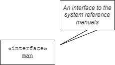
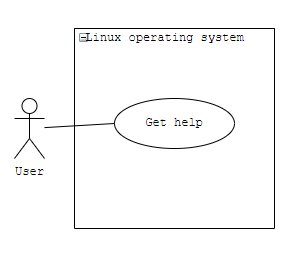

# Table of Contents

1.  [What will you learn?](#orgc7cf7b0)
2.  [Glossary](#orgdcee528)
3.  [Install Ubuntu under Windows 10](#org73f68e0)
4.  [Install a compiler](#orgf1c8af6)
5.  [Get helpful information](#org1c14e23)
6.  [UML diagrams for `man`](#org0874cac)
7.  [References](#org736da18)

# What will you learn?

> "It's nostalgic to edit, build and run C programs in text mode, but
> it works well and is quite efficient." --[Dan Gookin](#orgb422514)

-   Install Ubuntu under Windows 10
-   Install a compiler
-   Basic shell commands
-   Choose a text editor
-   Finding your code
-   Compiling and running

Source: [Gookin, chapter 1](#orgb422514)

# Glossary

<table border="2" cellspacing="0" cellpadding="6" rules="groups" frame="hsides">

<colgroup>
<col  class="org-left" />

<col  class="org-left" />
</colgroup>
<tbody>
<tr>
<td class="org-left"><a href="https://en.wikipedia.org/wiki/Compiler">Compiler</a></td>
<td class="org-left">Software to turn source code into executable code</td>
</tr>

<tr>
<td class="org-left">Shell</td>
<td class="org-left">Software to control your computer from the command line (using text)</td>
</tr>

<tr>
<td class="org-left">Editor</td>
<td class="org-left">Software to create and edit source code (as a text document)</td>
</tr>

<tr>
<td class="org-left">Ubuntu</td>
<td class="org-left">Popular Linux distribution or "distro"</td>
</tr>
</tbody>
</table>

# Install Ubuntu under Windows 10

The easiest way to get hold of C. [See this FAQ](https://github.com/birkenkrahe/org/blob/master/FAQ.md#how-can-i-install-linux-under-windows-10) on how to download
and run Ubuntu for free as an app from the Microsoft store under
Windows.

<table border="2" cellspacing="0" cellpadding="6" rules="groups" frame="hsides">

<colgroup>
<col  class="org-left" />

<col  class="org-left" />
</colgroup>
<tbody>
<tr>
<td class="org-left">Time</td>
<td class="org-left">ca. 15 min.</td>
</tr>
</tbody>
</table>

# Install a compiler

The GNU C compiler, `gcc`, already comes pre-installed with
Linux. You can check its version with the shell command `gcc
  --version`. The `--version` is a so-called Unix flag or command line
option. To see all command line options, you can use the `--help`
flag.

Another popular C compiler (with more options) is `clang`. Install
it in Ubuntu with the command `sudo apt install clang`. Let's look
at this command:

<table border="2" cellspacing="0" cellpadding="6" rules="groups" frame="hsides">

<colgroup>
<col  class="org-left" />

<col  class="org-left" />
</colgroup>
<tbody>
<tr>
<td class="org-left"><code>sudo</code></td>
<td class="org-left">any following command is executed with administrator rights</td>
</tr>

<tr>
<td class="org-left"><code>apt</code></td>
<td class="org-left">the software package manager program for Ubuntu</td>
</tr>

<tr>
<td class="org-left"><code>install</code></td>
<td class="org-left">utility program to install whatever follows</td>
</tr>

<tr>
<td class="org-left"><code>clang</code></td>
<td class="org-left">a C programming language compiler</td>
</tr>
</tbody>
</table>

# Get helpful information

Help information on a Unix system is stored in so-called manual or
`man` pages. Their format is standardized. There are man pages for
every one of the commands introduced so far. Try some of these:

<table border="2" cellspacing="0" cellpadding="6" rules="groups" frame="hsides">

<colgroup>
<col  class="org-left" />
</colgroup>
<tbody>
<tr>
<td class="org-left"><code>man gcc</code></td>
</tr>

<tr>
<td class="org-left"><code>man sudo</code></td>
</tr>

<tr>
<td class="org-left"><code>man apt</code></td>
</tr>

<tr>
<td class="org-left"><code>man install</code></td>
</tr>

<tr>
<td class="org-left"><code>man clang</code></td>
</tr>

<tr>
<td class="org-left"><code>man man</code></td>
</tr>
</tbody>
</table>

`man` itself is also a utility, and has a `man` page, of
course. When you open it, you see that `man` is an `interface`
program.

# UML diagrams for `man`

UML (Unified Modeling Language) is useful to create diagrams of
aspects of a system - in this case the diagram only says that `man`
is an interface. Another UML diagram for `man` shows its use from
outside the system, as a so-called use case diagram:

The diagram says that 

# References

 King (2008). C Programming - A Modern
Approach. Norton. [Online: knking.com](http://knking.com/books/c2/index.html).

 Kernighan/Ritchie (1978). The C Programming
Language. Prentice Hall. [Online: wikipedia.org](https://en.wikipedia.org/wiki/The_C_Programming_Language).

 Lemonaki, Dionysia (November 4, 2021). C vs. C++ -
What's The Difference [blog]. URL: [freecodecamp.org.](https://www.freecodecamp.org/news/c-vs-cpp-whats-the-difference/)

 Gookin D (2021). Tiny C Projects. Manning.

