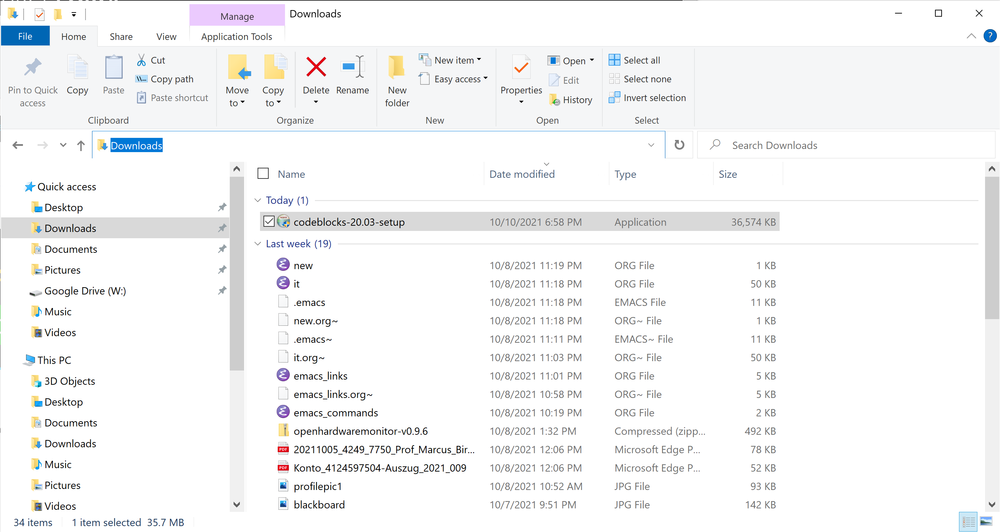
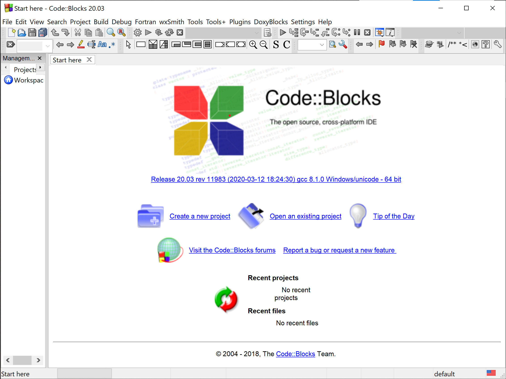

# Table of Contents

1.  [What are you going to learn?](#org79ed47a)
2.  [Codeblocks IDE](#org7421e32)
    1.  [What is Codeblocks IDE?](#org160497e)
    2.  [What is an IDE?](#orgfd2fd97)
    3.  [Why are we using Codeblocks IDE?](#orgf6ea12d)
    4.  [What are some alternatives to IDEs?](#org65d55df)
    5.  [What are some alternatives to Codeblocks IDE?](#org29f853b)
3.  [Download and install](#org87f3817)
    1.  [Download](#org479c26c)
    2.  [Installation](#org86750e9)
    3.  [Testing](#orgad76364)
4.  [References](#org82accb8)

# What are you going to learn?

-   What is Codeblocks IDE?
-   What is an IDE?
-   Why are we using Codeblocks IDE?
-   How to download and install the program
-   How to get started with a simple file
-   Limitations of Codeblocks (and other IDEs)
-   Alternatives to IDEs

# Codeblocks IDE

## What is Codeblocks IDE?

## What is an IDE?

## Why are we using Codeblocks IDE?

## What are some alternatives to IDEs?

## What are some alternatives to Codeblocks IDE?

# Download and install

Codeblocks is an open source program. It is freely available and you
don't need to give up (much of<a id="fnr.1" class="footref" href="#fn.1">1</a>) your private data to get the
program.

## Download

-   [Binary release download](https://www.codeblocks.org/downloads/binaries/)<a id="fnr.2" class="footref" href="#fn.2">2</a> for your <a id="fnr.3" class="footref" href="#fn.3">3</a>OS from [codeblocks.org](#orge0e65ab)
-   Choose the `codeblocks-XX.YY-setup.exe` variant

## Installation

-   Run the file directly from the download folder
-   Agree when asked if you're okay with the program making changes to
    your computer though it was downloaded from the web<a id="fnr.4" class="footref" href="#fn.4">4</a>
    
    

-   The program will guide you through a setup dialog
-   Close other applications before continuing
-   Keep pre-sets
-   Agree to open Codeblocks, then close it: `CTRL-q`
-   When asked if you want to change the default say "no"
    
    

## Testing

# References

 Online: codeblocks.org

 Online: sourceforge.net

# Footnotes

<a id="fn.1" href="#fnr.1">1</a> In fact, the site will of course store data related to your
network location and access manner - your operating system, and many
details that could, in principle, be used to trace the download back
to you.

<a id="fn.2" href="#fnr.2">2</a> A "binary" program is a file that will run on your computer
without any extra effort. This means that the program is suited to the
specifics of the computer. The binary itself is compiled from
so-called "source code", the original, human-readable format of the
code. The binary, on the other hand, can only be read by a machine.

<a id="fn.3" href="#fnr.3">3</a> OS = Operating System - likely to be one of: Windows 10, MacOS,
or Linux. Android and iOS are also operating systems, but for mobile
devices only. See also: course CSC 420 on Operating Systems.

<a id="fn.4" href="#fnr.4">4</a> This is not something to agree upon lightly. Always make sure
you know the source of the program and that you can trust it. In this
case, I downloaded the executable file from
[sourceforge.net](#org8810ab2), which is a trustworthy platform
similarly to GitHub ([more](https://en.wikipedia.org/wiki/SourceForge)).
